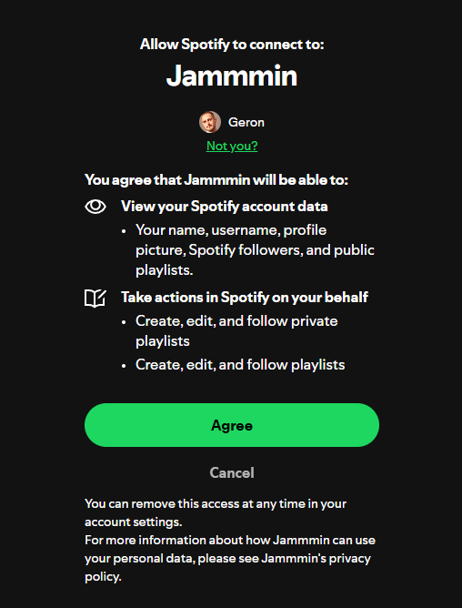
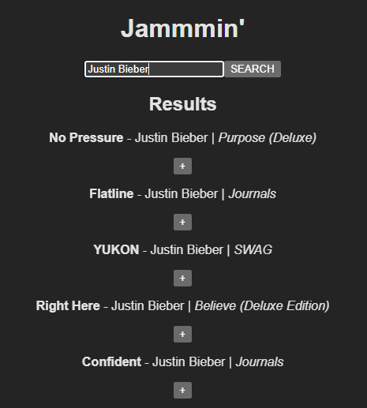
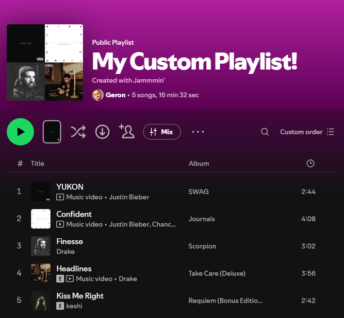

# Jammmin'
Jammmin' is a **React web application** that allows users to **search for songs that are on Spotify**, **create a custom playlist**, and then **save them directly to their own Spotify account!** The app demonstrates working with the **Spotify Web API**, **OAuth 2.0 Authentication (PKCE flow)**, and **React state management**.

### Features

- ***Search Spotify tracks***: Look up songs or artists using Spotify's search API.
- ***Create Custom Playlists***: Add tracks to a custom playlist.
- ***Save to Spotify***: Save your custom-made playlist directly to your own Spotify account.

### Demo

### Technologies Used
- **React**
- **Vite**
- **Spotify Web API**
- **OAuth 2.0 (PKCE flow)**
- **JavaScript**

### Installation
1. Clone the repository:
    - git clone https://github.com/GeronGitHub/Jammmin-
    - cd Jammmin-
2. Install dependencies:
    - npm install
3. Start the development server:
    - npm run dev -- --host 127.0.0.1 --port 5173

### Usage
1. Open the app in your browser
2. Search for your favourite songs or artists
3. Add (or remove) tracks from a custom playlist
4. Click **Save to Spotify** to add the playlist to your Spotify account.

### Future Improvements
- Enhance the UI with CSS to make the app more visually appealing and user-friendly.
- Add responsive design for mobile devices.
- Add functionality to playback the track before adding it to the playlist.

### Acknowledgement
- Spotify Web API Documentation
- Codecademy Full-Stack Engineer Career Path